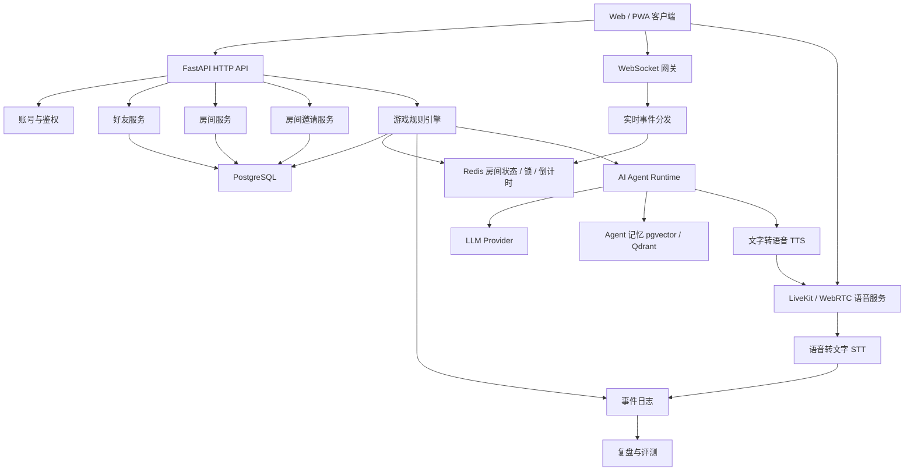

# 远程联机狼人杀游戏与多 Agent 系统架构方案

生成日期：2026-06-14

## 1. 项目定位

本项目按“远程联机游戏”来设计，而不是只做一个 AI 实验脚本。系统需要支持玩家通过手机、平板或电脑无线联网进入同一个房间，使用文字或语音进行狼人杀对局，同时允许房间内出现真人玩家、AI 玩家，或两者混合。

当前联机边界：不做随机匹配、不做大厅自动匹配队列，也不做陌生人邀请码入房。真人联机只通过“游戏 UUID 加好友”和“房主邀请好友进房间”完成。

核心模式：

- 纯真人对战：所有座位都由真实玩家控制。
- 纯 AI 对战：所有座位都由 AI Agent 控制，可用于自动模拟和策略评测。
- 真人 + AI 混合对战：部分座位是真人，部分座位由 AI 补位或参与博弈。
- 好友邀请对战：玩家通过游戏 UUID 添加好友，房主从好友列表拉人进入房间。
- 文字发言：支持公开聊天、阶段发言、私密系统提示、投票理由。
- 语音发言：支持实时语音、按阶段开麦、夜晚私密语音房、可选语音转文字。
- 弹性房间：房间人数、角色种类、角色数量、发言顺序、发言时长、投票规则都应可配置。

第一版应优先保证“能注册/登录、用 UUID 加好友、邀请好友进房、完整玩一局、可复盘”。AI 策略深度、语音增强和复杂 UI 可以逐步增强。

## 2. 总体设计原则

- 游戏规则必须由服务端裁决，客户端和 AI 都不能直接修改游戏状态。
- 不设计随机匹配服务，避免过早引入匹配队列、段位、等待池和反作弊复杂度。
- 玩家关系链是联机入口：用户通过游戏 UUID 建立好友关系，再由房主邀请好友进房。
- 房间配置必须数据化，不能把人数和角色写死在代码里。
- 真人、AI、观众都抽象为房间参与者，但权限不同。
- 文字、语音、投票、夜晚行动都要进入统一事件流，便于同步、断线恢复和复盘。
- 语音链路和游戏状态链路分离：语音走 WebRTC/SFU，游戏事件走 WebSocket。
- AI Agent 只看到其应当看到的信息，不能因为调试或上下文拼接泄漏身份与夜晚信息。
- 先支持 Web/PWA，后续再做原生 App；这样能最快满足“远程无线联机”。

## 3. 推荐技术栈

### 3.1 客户端

推荐：React + TypeScript + PWA

用途：

- 个人主页、游戏 UUID 展示、搜索 UUID、好友列表、好友申请。
- 房间大厅、创建房间、邀请好友、房间邀请通知、座位列表。
- 游戏桌面、身份卡、阶段提示、倒计时、发言区、投票面板。
- 文字聊天、系统公告、历史事件、复盘页面。
- 语音开麦、静音、发言状态、断线重连提示。

为什么先做 Web/PWA：

- 手机和电脑都能直接访问，不需要先上架应用商店。
- 可通过局域网、内网穿透或公网域名快速远程测试。
- WebRTC 和 WebSocket 在现代浏览器中支持成熟。

后续可选：

- React Native：如果需要 iOS/Android 原生体验。
- Tauri / Electron：如果需要桌面客户端。

### 3.2 后端语言与框架

推荐：Python 3.11+ + FastAPI

用途：

- 账号、好友、房间邀请、游戏、规则、投票、聊天、复盘 API。
- WebSocket 连接管理和实时游戏事件推送。
- AI Agent 编排、模型调用、语音转文字与文字转语音任务。

选择 Python 的原因：

- AI Agent、LLM、语音识别、评测分析生态更完整。
- 狼人杀规则引擎和状态机用 Python 实现效率高。
- 后续做纯 AI 批量对局和策略实验更方便。

如果未来并发量较高，可以把实时网关或语音服务拆到 Node.js / Go，但 MVP 不建议过早拆分。

### 3.3 实时文字与游戏事件

推荐：WebSocket

用途：

- 房间成员上下线。
- 游戏阶段切换。
- 发言开始/结束。
- 投票状态更新。
- 夜晚行动请求。
- 系统公告和公开聊天。
- 私密身份与技能提示。

原则：

- 所有 WebSocket 消息都带 `room_id`、`game_id`、`event_id`、`visibility`、`server_time`。
- 客户端只做展示和输入，所有状态以服务端事件为准。
- 断线重连后客户端通过 `last_event_id` 补拉缺失事件。

### 3.4 语音通信

推荐优先级：

1. LiveKit：推荐 MVP 使用，封装了 WebRTC SFU、房间、参与者、音轨、服务端 SDK，适合快速做多人语音房。
2. mediasoup：更底层、可控性更强，但开发成本更高，适合后期自研深度语音能力。
3. 原生 WebRTC Mesh：只适合很小房间实验，不推荐用于正式多人狼人杀，因为多人互连复杂且带宽压力大。

语音架构：

- 游戏服务负责判断“谁此刻可以说话”。
- 语音服务负责实时音频传输。
- 客户端根据游戏阶段自动打开或关闭麦克风权限。
- 白天发言可开放给当前发言人，讨论模式可开放给所有存活玩家。
- 夜晚狼人讨论可创建狼人私密语音子房间或私密音轨订阅策略。
- 死亡玩家、观众、旁观者默认禁麦，是否开放由房间规则决定。

建议增强能力：

- STT：语音转文字，生成发言记录，供复盘和 AI Agent 理解真人发言。
- TTS：AI Agent 文字转语音，让 AI 在真人语音局中“开口说话”。
- 录音：可选保存音频片段，但需要明确告知玩家并提供房间开关。

### 3.5 存储与中间件

MVP 推荐：

- PostgreSQL：保存账号、游戏 UUID、好友关系、好友申请、房间邀请、房间、对局、玩家状态、规则配置、事件日志、投票、复盘。
- Redis：保存在线连接、房间临时状态、分布式锁、倒计时、轻量消息队列。
- 对象存储：保存头像、语音录音、复盘导出文件，可用 S3 兼容服务或本地 MinIO。

AI 增强阶段：

- pgvector 或 Qdrant：保存 Agent 记忆、历史对局片段、玩家行为画像。
- Redis Streams / Celery / Dramatiq：处理 AI 决策、STT、TTS、复盘生成、批量模拟。
- OpenTelemetry + Prometheus + Grafana：监控延迟、错误率、房间数量、语音质量、模型成本。

### 3.6 AI 与语音模型

LLM：

- OpenAI API：高质量推理、发言、角色策略。
- 兼容 OpenAI 协议的模型服务：便于接入不同云模型。
- 本地模型：适合纯 AI 批量对局和低成本测试。

STT：

- 云端语音识别：质量更稳定，适合 MVP。
- 本地 Whisper / faster-whisper：成本可控，但需要 GPU 或接受延迟。

TTS：

- 云端 TTS：语音自然，接入快。
- 本地 TTS：适合离线部署或成本敏感场景。

关键要求：

- AI 发言必须可以输出文字，即使最终通过 TTS 播放，也要保留文本事件。
- 真人语音如果要让 AI 理解，应尽量转成文字事件并写入对局上下文。
- AI 夜晚行动必须结构化输出，不能只输出自然语言。

## 4. 总体架构



模块边界：

- 客户端：输入、展示、音频采集与播放，不做规则裁决。
- HTTP API：负责账号、好友、房间邀请、创建房间、加入房间、读取配置、开始游戏、查询复盘。
- WebSocket 网关：负责实时事件下发、客户端动作接收、断线恢复。
- 语音服务：负责实时音频，不直接决定游戏规则。
- 好友服务：负责游戏 UUID 搜索、好友申请、好友关系、拉黑和删除好友。
- 房间邀请服务：负责房主邀请好友、邀请通知、接受/拒绝、邀请过期和权限校验。
- 房间服务：管理座位、玩家、AI 补位、观众、房间配置。
- 游戏规则引擎：唯一可信状态机，负责阶段推进、行动合法性、胜负判断。
- Agent Runtime：把 AI 玩家接入游戏，生成发言、投票和夜晚行动。
- 事件日志：统一保存文字、语音转写、投票、技能、系统事件和 AI 调用摘要。

## 5. 好友与房间邀请流程

当前不做随机匹配联机，所有真人联机入口都基于好友关系。

### 5.1 游戏 UUID

每个用户创建账号后生成一个全局唯一的游戏 UUID，用于被其他玩家搜索和添加好友。

UUID 设计建议：

- `user_id`：数据库内部主键，不直接暴露。
- `game_uuid`：对外展示的游戏 ID，用于搜索好友。
- `display_name`：昵称，可重复，可修改。
- `avatar_url`：头像。

示例：

```json
{
  "user_id": "usr_7f2a",
  "game_uuid": "8K4D-2Q9M",
  "display_name": "白狼王",
  "avatar_url": "https://example.com/avatar.png"
}
```

`game_uuid` 可以使用短码形式，便于手动输入；服务端仍需要保证唯一性。不要把数据库自增 ID 作为公开好友 ID。

### 5.2 添加好友流程

流程：

1. 玩家 A 输入玩家 B 的 `game_uuid`。
2. 服务端返回 B 的基础公开资料，例如昵称和头像。
3. A 发送好友申请。
4. B 收到 WebSocket 通知，也可以在好友申请列表中查看。
5. B 接受后，双方建立好友关系。
6. 任意一方可删除好友或拉黑对方。

好友申请状态：

- `pending`：等待处理。
- `accepted`：已通过。
- `rejected`：已拒绝。
- `cancelled`：申请方取消。
- `blocked`：被拉黑，不再允许发送申请和邀请。

### 5.3 邀请好友进房流程

流程：

1. 房主创建房间。
2. 房主从好友列表选择玩家并发送房间邀请。
3. 被邀请玩家收到实时通知。
4. 玩家接受邀请后进入房间并占用座位。
5. 玩家拒绝、超时或房间已满时，邀请失效。
6. 房主可以添加 AI 玩家补位。

房间邀请示例：

```json
{
  "invite_id": "inv_001",
  "room_id": "room_001",
  "from_user_id": "usr_host",
  "to_user_id": "usr_friend",
  "status": "pending",
  "expires_at": "2026-06-14T12:05:00Z"
}
```

权限规则：

- 只有房主或被授权的房间管理员可以邀请好友。
- 默认只能邀请好友，不能邀请陌生人。
- 被拉黑关系不能互相邀请。
- 房间已开局后是否允许邀请，由房间规则决定；默认不允许真人中途加入。
- AI 补位不需要好友关系，由房主直接添加。

### 5.4 不做匹配系统的影响

暂不实现：

- 随机匹配队列。
- 段位或 MMR。
- 自动组队。
- 公共房间列表。
- 陌生人快速加入。

保留扩展点：

- 未来可以在好友邀请之外增加公开房间或匹配队列。
- 当前房间服务应避免写死“必须来自好友邀请”，而是通过 `join_policy` 控制加入策略。

## 6. 房间与规则配置

由于人数和角色种类未确定，必须设计成可配置规则集。

房间配置示例：

```json
{
  "room_id": "room_001",
  "name": "周末语音局",
  "capacity": 12,
  "join_policy": "friends_invite_only",
  "seat_mode": "human_ai_mixed",
  "speech_mode": "voice_and_text",
  "discussion_mode": "round_robin",
  "day_speech_seconds": 90,
  "vote_seconds": 45,
  "allow_spectators": true,
  "allow_dead_chat": false,
  "roles": [
    { "role": "werewolf", "count": 3 },
    { "role": "villager", "count": 4 },
    { "role": "seer", "count": 1 },
    { "role": "witch", "count": 1 },
    { "role": "hunter", "count": 1 },
    { "role": "guard", "count": 1 }
  ]
}
```

需要支持的配置维度：

- 人数：6、8、9、10、12、更多自定义人数。
- 角色：狼人、村民、预言家、女巫、猎人、守卫等，后续可插件化扩展。
- 席位类型：真人限定、AI 限定、真人优先 AI 补位、任意混合。
- 发言模式：轮流发言、自由讨论、警长竞选、遗言、私聊禁用或启用。
- 语音模式：纯文字、纯语音、语音 + 文字、AI 自动朗读。
- 投票规则：一轮投票、平票重投、警长票权、弃票是否允许。
- 观战规则：允许观众、延迟观战、死亡后观战、死亡后发言。
- 复盘规则：是否展示身份、是否展示夜晚行动、是否展示 AI 思考摘要。

## 7. 玩家、AI 与座位模型

统一抽象：

```python
class ParticipantType(str, Enum):
    HUMAN = "human"
    AI = "ai"
    SPECTATOR = "spectator"

class SeatState(str, Enum):
    EMPTY = "empty"
    OCCUPIED = "occupied"
    READY = "ready"
    DISCONNECTED = "disconnected"
    BOT_TAKEOVER = "bot_takeover"
```

座位设计要支持：

- 真人主动加入。
- 房主添加 AI 玩家。
- 开局前 AI 补齐空位。
- 真人断线后短时间等待重连。
- 超时未重连时由 AI 临时托管。
- 中途不能随意替换身份，除非房间规则明确允许。

AI 玩家和真人玩家的输入最终都转换成统一动作：

```json
{
  "actor_id": "player_3",
  "source": "human | ai | bot_takeover",
  "action_type": "speech | vote | night_action | ready",
  "payload": {},
  "client_event_id": "optional",
  "created_at": "2026-06-14T12:00:00Z"
}
```

## 8. 游戏核心状态机

主要阶段：

1. `LOBBY`：创建房间、玩家入座、AI 补位、配置规则、准备。
2. `ASSIGN_ROLES`：服务端分配身份，只向对应玩家发送私密身份事件。
3. `NIGHT_START`：进入夜晚，关闭普通玩家公共发言。
4. `NIGHT_ACTION`：狼人、预言家、女巫、守卫等按规则行动。
5. `NIGHT_RESOLVE`：结算夜晚结果。
6. `DAWN`：公布死亡信息。
7. `DAY_DISCUSSION`：白天发言，按房间配置启用语音或文字。
8. `VOTING`：投票。
9. `EXILE`：放逐结算和遗言。
10. `CHECK_WIN`：判断胜负。
11. `GAME_OVER`：展示结果，生成复盘。

状态原则：

- 状态机只接受合法动作，不合法动作拒绝并返回错误事件。
- 所有阶段切换必须写入事件日志。
- 倒计时由服务端控制，客户端只展示。
- AI 和真人的超时都要有默认动作，例如跳过、弃票、随机合法目标。
- 角色技能由规则模块注册，后续新增角色不应大改主状态机。

## 9. 实时语音与文字发言设计

### 9.1 文字发言

文字发言包括：

- 公开聊天。
- 阶段发言。
- 投票理由。
- 系统提示。
- 私密技能结果。
- AI 发言文本。
- 语音转写文本。

所有文字类内容统一写入 `events` 表，并按可见性推送。

### 9.2 语音发言

语音控制建议由游戏状态驱动：

- `LOBBY`：所有入座玩家可自由语音。
- `NIGHT_ACTION`：普通玩家禁麦，狼人可进入狼人私密语音。
- `DAY_DISCUSSION`：按规则开放当前发言人或全员讨论。
- `VOTING`：可禁麦，避免投票阶段继续影响。
- `GAME_OVER`：可全员开麦复盘。

语音事件建议：

```json
{
  "type": "voice_track_started",
  "actor_id": "player_2",
  "room_id": "room_001",
  "phase": "DAY_DISCUSSION",
  "visibility": "public"
}
```

STT 转写事件建议：

```json
{
  "type": "speech_transcript",
  "actor_id": "player_2",
  "text": "我觉得 5 号昨晚行为很可疑。",
  "source": "stt",
  "confidence": 0.91,
  "visibility": "public"
}
```

### 9.3 AI 参与语音局

AI 在语音局中有两种表现方式：

- 文本 AI：AI 只在文字区发言，真人可读文字。
- 语音 AI：AI 生成文字后通过 TTS 播放，同时保存文字记录。

建议 MVP 先做文本 AI，再接 TTS。原因是狼人杀首先需要规则正确和上下文准确，TTS 属于体验增强。

## 10. Agent 设计

Agent 不应该是独立游戏玩家实现，而应该是 `Participant` 的一种控制器。

Agent 类型：

- `RuleBasedAgent`：规则型 AI，用于兜底、测试、补位。
- `LLMAgent`：大模型驱动，生成发言、投票、夜晚行动。
- `HybridAgent`：规则生成候选动作，LLM 选择并解释。
- `TakeoverAgent`：真人断线后的临时托管。

Agent 输入：

- 当前阶段。
- 自身身份、阵营、存活状态。
- 可见公开事件。
- 自身私密事件。
- 房间规则。
- 最近发言摘要。
- 投票历史。
- 可选长期记忆。

Agent 输出必须结构化：

```json
{
  "speech": "我先不跳身份，但 4 号的站边变化太快。",
  "vote_target": "player_4",
  "night_action": null,
  "public_reason": "4 号前后逻辑不一致。",
  "confidence": 0.68
}
```

可见性要求：

- AI 不能读取完整数据库状态，只能通过 `VisibleGameContext` 获取信息。
- 狼人 AI 只能知道狼人队友和狼人夜晚信息。
- 神职 AI 只能知道自己的技能结果。
- 复盘用的完整日志不能进入对局中的 Agent 上下文。

## 11. 数据模型建议

核心表：

- `users`：真实用户账号、游戏 UUID、昵称、头像、登录方式。
- `friend_requests`：好友申请、申请方、接收方、状态、申请留言、过期时间。
- `friendships`：双向好友关系、建立时间、备注名。
- `blocks`：拉黑关系，限制好友申请、房间邀请和私信。
- `rooms`：房间、房主、状态、加入策略、当前规则集。
- `room_invites`：房间邀请、邀请方、被邀请好友、状态、过期时间。
- `room_seats`：座位编号、参与者类型、用户或 AI 配置、准备状态、连接状态。
- `rule_sets`：人数、角色、发言、投票、语音、观战和复盘规则。
- `games`：单局游戏、seed、开始结束时间、胜方、房间快照。
- `game_player_states`：身份、阵营、生死、技能使用、座位映射。
- `events`：统一事件日志，包含 public/private/system/team visibility。
- `actions`：真人或 AI 提交的动作。
- `votes`：投票记录。
- `voice_sessions`：语音房间、参与者、音轨状态、录音配置。
- `transcripts`：语音转写文本。
- `agent_configs`：AI 模型、提示词版本、策略参数、TTS 音色。
- `agent_traces`：AI 输入摘要、输出、模型、耗时、token、错误。
- `replays`：复盘报告、时间线、统计指标。

事件可见性：

- `public`：所有存活玩家和允许观战者可见。
- `private`：只对单个玩家可见，例如身份、查验结果。
- `team`：对同阵营或同频道可见，例如狼人夜聊。
- `system`：只给服务端或管理员。
- `replay_only`：对局结束后复盘可见。

## 12. 目录结构建议

```text
werewolf_agent/
  app/
    api/
      routes_auth.py
      routes_friends.py
      routes_rooms.py
      routes_invites.py
      routes_games.py
      routes_replays.py
      websocket.py
    friends/
      service.py
      requests.py
      blocks.py
    realtime/
      connection_manager.py
      event_dispatcher.py
      presence.py
    voice/
      livekit_service.py
      permissions.py
      stt.py
      tts.py
    rooms/
      service.py
      invites.py
      seats.py
      ruleset.py
    engine/
      state.py
      phases.py
      reducer.py
      roles/
      victory.py
    agents/
      base.py
      llm_agent.py
      rule_agent.py
      takeover_agent.py
      prompts/
    llm/
      client.py
      providers.py
    memory/
      store.py
      retriever.py
    models/
      orm.py
      schemas.py
      database.py
    replay/
      timeline.py
      report.py
    config.py
    main.py
  web/
    src/
      pages/
      components/
      voice/
      game/
  tests/
    test_ruleset.py
    test_state_machine.py
    test_visibility.py
    test_reconnect.py
  docs/
    multi-agent-werewolf-architecture.md
  docker-compose.yml
  pyproject.toml
```

## 13. MVP 路线

### 第 1 阶段：远程文字联机核心

目标：玩家通过游戏 UUID 加好友，房主邀请好友进入同一房间，用文字完整玩一局。

- 实现账号登录和游戏 UUID 展示。
- 实现通过游戏 UUID 搜索玩家。
- 实现好友申请、接受、拒绝、删除、拉黑。
- 实现创建房间、好友邀请、接受邀请进房、座位、准备、AI 补位。
- 明确不实现随机匹配、陌生人快速加入和公共匹配池。
- 实现可配置角色和人数。
- 实现服务端状态机、投票、胜负判断。
- 实现 WebSocket 事件同步和断线重连。
- 实现文字发言和复盘日志。

验收标准：

- 玩家可以通过 UUID 加好友。
- 房主可以从好友列表邀请 6 到 12 人进入房间。
- 支持纯真人、纯 AI、真人 + AI 三种模式。
- 完整一局可结束并生成事件时间线。

### 第 2 阶段：AI Agent 稳定接入

目标：AI 能作为正常玩家参与，而不是单独模拟脚本。

- 实现 `ParticipantController`，统一真人输入与 AI 输入。
- 接入 LLM Agent 的发言、投票、夜晚行动。
- 增加 AI 超时、非法输出重试、默认动作。
- 保存 AI 调用 trace。
- 做可见性测试，防止信息泄漏。

验收标准：

- 房主可选择添加 AI 或用 AI 补位。
- 真人和 AI 能混合完成一局。
- AI 只接收自己可见的信息。

### 第 3 阶段：实时语音

目标：远程玩家可以用语音进行狼人杀。

- 接入 LiveKit 或同类 WebRTC SFU。
- 实现语音房间 token 签发。
- 根据游戏阶段控制开麦权限。
- 实现白天发言、狼人夜聊、死亡禁麦。
- 可选接入 STT，把语音转为文本事件。

验收标准：

- 多名远程玩家可稳定语音。
- 阶段切换能正确控制谁能说话。
- 语音转写可进入复盘和 AI 上下文。

### 第 4 阶段：游戏体验与复盘

目标：让它像真正的游戏产品。

- 优化移动端 UI。
- 增加房主控制台。
- 增加断线托管和重连恢复。
- 增加复盘页面，展示发言、投票、身份和夜晚行动。
- 增加战绩、玩家统计、AI 统计。

验收标准：

- 手机浏览器可完成全流程。
- 断线后可恢复房间状态。
- 对局结束后可查看完整复盘。

### 第 5 阶段：规模化和商业化准备

目标：支持更多房间和长期运营。

- 服务拆分：API、实时网关、Agent Worker、语音服务、复盘 Worker。
- 增加限流、风控、举报、封禁。
- 增加监控、日志、告警。
- 支持多实例部署和 Redis 分布式房间状态。
- 优化 AI 成本和语音成本。

## 14. 部署建议

本地开发：

- Docker Compose 启动 PostgreSQL、Redis、LiveKit、MinIO。
- FastAPI 本地运行。
- Web 客户端本地 Vite 开发服务器。

内测部署：

- 一台云服务器部署 API、Web、PostgreSQL、Redis、LiveKit。
- 使用 HTTPS 域名，WebRTC 在浏览器中通常需要安全上下文。
- 配置 TURN 服务，解决部分 NAT 网络下语音连接问题。

生产部署：

- Web 静态资源部署到 CDN。
- API 和 WebSocket 服务多实例部署。
- Redis 用于连接状态、倒计时和跨实例事件分发。
- PostgreSQL 做主数据存储，定期备份。
- LiveKit/语音服务独立扩容。
- Agent Worker 独立扩容，防止模型调用阻塞游戏主流程。

## 15. 关键风险

- 语音复杂度：WebRTC 多人语音比文字联机复杂，MVP 应使用成熟 SFU 服务而非自研。
- 信息泄漏：真人、AI、观众、死亡玩家的可见信息必须严格隔离。
- 断线重连：移动网络不稳定，必须从第一版就设计重连和超时托管。
- 房间规则膨胀：角色和规则必须插件化，否则后续新增角色会破坏状态机。
- AI 延迟：模型调用可能慢，必须有超时、默认动作和异步 Worker。
- 成本控制：语音、STT、TTS、LLM 都可能产生持续成本，需要房间级开关和预算限制。
- 内容安全：语音和文字都可能产生违规内容，需要举报、禁言和审核机制。

## 16. 推荐默认选型

建议从以下组合启动：

- 客户端：React + TypeScript + PWA
- 后端：Python 3.11+ + FastAPI
- 实时事件：WebSocket
- 语音：LiveKit
- 数据库：PostgreSQL
- 缓存和房间临时状态：Redis
- 对象存储：MinIO，本地或 S3 兼容服务
- AI 编排：自研状态机 + LangGraph 可选
- LLM 接入：OpenAI API 或兼容 OpenAI 协议的模型网关
- STT/TTS：第二阶段后接入，先保留接口
- 部署：Docker Compose 起步，后续拆分为多服务

这套方案的核心是：把狼人杀先做成一个服务端裁决的实时联机游戏，再把 AI 作为可插拔玩家控制器接入；语音作为独立实时媒体链路接入，不和游戏状态机混在一起。

## 17. 参考资料

- FastAPI WebSocket 文档：https://fastapi.tiangolo.com/advanced/websockets/
- MDN WebRTC API：https://developer.mozilla.org/en-US/docs/Web/API/WebRTC_API
- LiveKit 文档：https://docs.livekit.io/
- mediasoup 文档：https://mediasoup.org/documentation/
- Redis Streams 文档：https://redis.io/docs/latest/develop/data-types/streams/
- PostgreSQL JSON 类型文档：https://www.postgresql.org/docs/current/datatype-json.html
- Qdrant 概览：https://qdrant.tech/documentation/overview/
